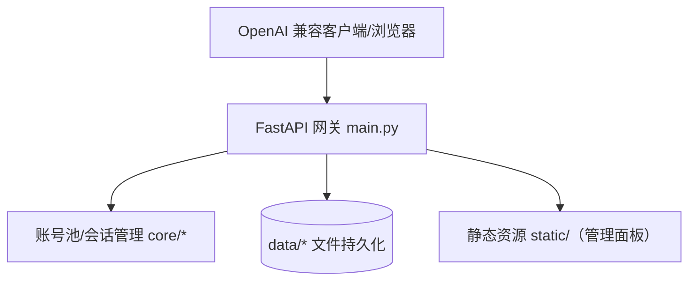
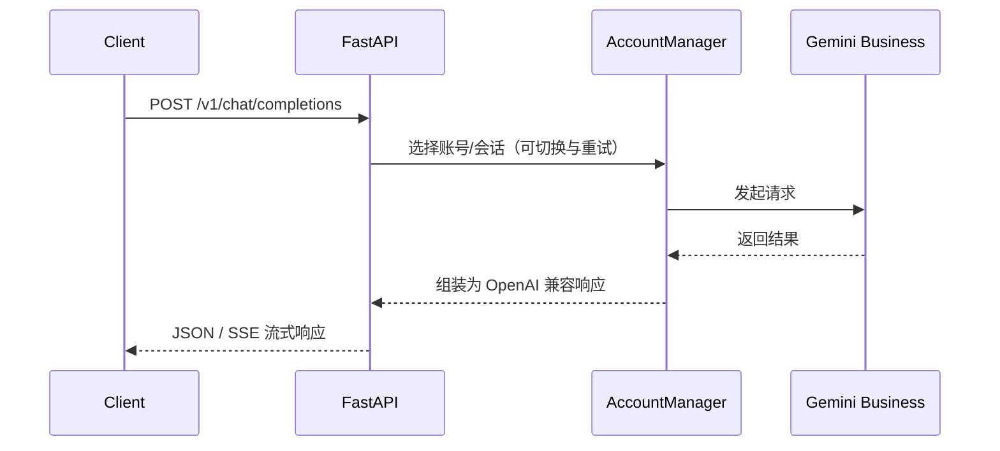

# 架构设计

## 总体架构

## 技术栈
- **后端:** Python 3.11 + FastAPI + Uvicorn
- **前端:** Vue 3 + Vite（构建为静态资源由后端托管）
- **存储:** 文件持久化（`data/settings.yaml`, `data/accounts.json` 等）
- **部署:** Dockerfile（前后端多阶段构建）+ docker-compose（端口映射与数据卷）

## 核心流程

## 重大架构决策
完整的 ADR 存储在各变更的 how.md 中，本章节提供索引。

| adr_id | title | date | status | affected_modules | details |
|--------|-------|------|--------|------------------|---------|

